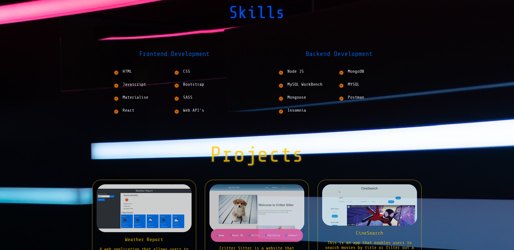
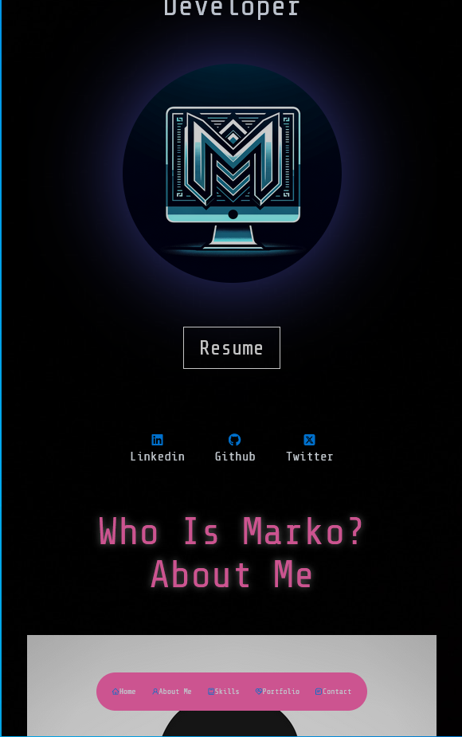

# React-Portfolio

## Description
This portfolio showcases a single-page application developed using React, React icons, HTML, and CSS3. It provides a platform 
for developers to share and collaborate on six projects. By exploring this portfolio, employers can evaluate candidates' proficiency 
in building single-page applications and assess whether their skills align with their desired qualifications.

## Installation
This application can be accessed via its deployed site link.
<a href='https://lucent-churros-865ead.netlify.app'> Link to deployed </a>
## Screenshot

This is my portfolio website on a desktop screen
 

 
This is my portfolio website on a mobile device screen

## License
This project is licensed under the terms of the MIT license
